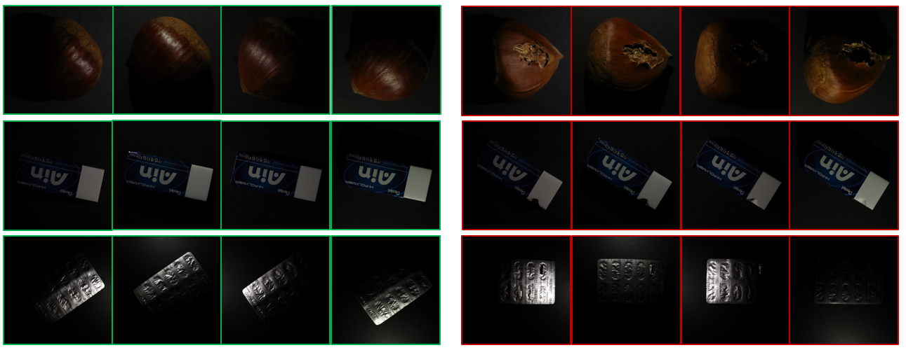
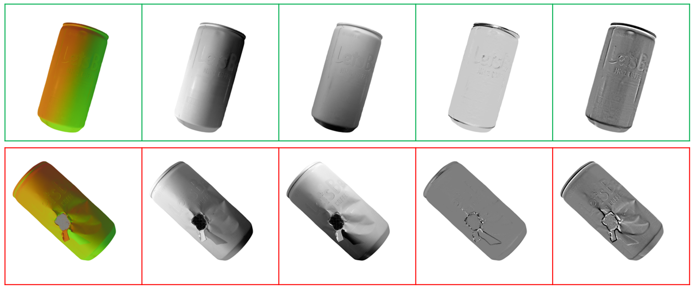

# A Comprehensive Real-World Photometric Stereo Dataset for Unsupervised Anomaly Detection

This is the official implementation of our paper, [A Comprehensive Real-World Photometric Stereo Dataset for Unsupervised Anomaly Detection](https://ieeexplore.ieee.org/document/9916256).

## PSAD Dataset

You can download the PSAD dataset through the following link.  

[download PSAD dataset](https://cnu365-my.sharepoint.com/:u:/g/personal/jjy9385_o_cnu_ac_kr/EeAfcf2zU9NCoz8KjhpeJA8BA5Xv6gp0yxryw-o5AsSUXw)  


The PSAD dataset is a new anomaly detection dataset with a photometric stereo set up. It contains over 10,000 high-resolution images divided into ten different object categories.





The normal map of our data set was created using the Woodham method. We provide `light_directions.txt` for each category, so if you want to create a normal map in a different way, you can use `light_directions.txt`. The `light_directions.txt` file is located in the `light_calibration` folder for each category. Note that we do not remove the background using a binary mask.

## Project Hierarchy

<pre>
PSAD
│  <font color='green'>README.md</font> <- current readme page 
│  
├─images
│      ...
│      
├─PSAD_DifferNet
│  │  ...
│  │  <font color="red">README.md</font> <b><- explain how to run PSAD_DifferNet</b>
│  │  ...
│  │  
│          
├─PSAD_MKDAD
│  │  ...
│  │  <font color="red">README.md</font> <b><- explain how to run PSAD_MKDAD</b>
│  │  ...
│          
└─PSAD_skip_ganomaly
    │  ...
    │  <font color="red">README.md</font> <b><- explain how to run PSAD_skip_ganomaly</b>
    │  ...
</pre>


Benchmark models exist for each folder. (e.g. inside the PSAD_MKDAD folder for MKDAD models)
Experiments can be reproduced for each model. Details are written in the **README of each folder.**


For example, if you want to reproduce the experimental results of the MKDAD model in our paper, click the PSAD_MKDAD folder and read README.md in the folder.


Note that the libraries of requirements (e.g. pytorch, torchvision) version is slightly different for each model.

## Citation

If you find this useful for your research, please cite our paper:  
```bibtex
@ARTICLE{9916256,
  author={Jung, Junyong and Han, Seungoh and Park, Jinsun and Cho, Donghyeon},
  journal={IEEE Access}, 
  title={A Comprehensive Real-World Photometric Stereo Dataset for Unsupervised Anomaly Detection}, 
  year={2022},
  volume={10},
  number={},
  pages={108914-108923},
  doi={10.1109/ACCESS.2022.3214003}}
```